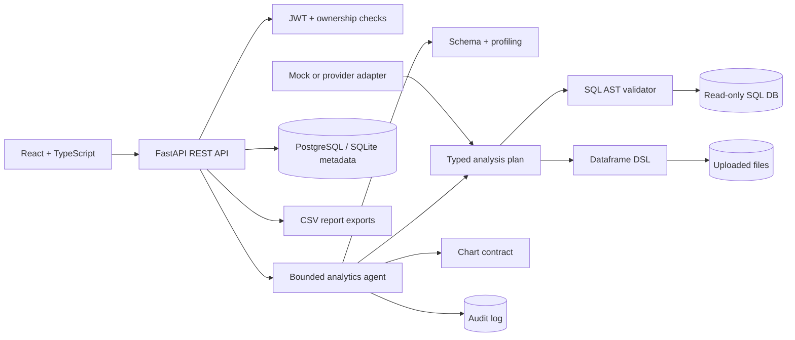
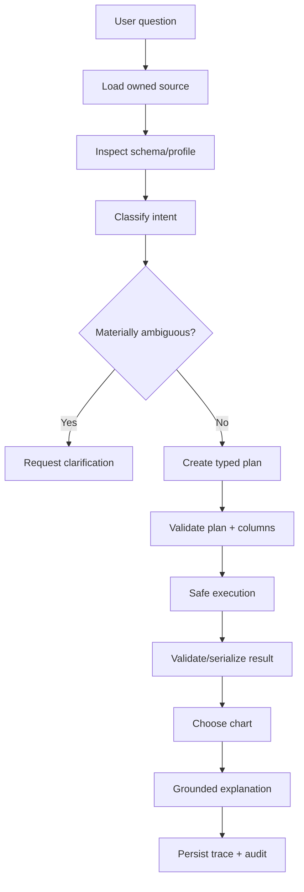

# Asteria Analyst AI

**Ask your data. Understand the answer. Act with confidence.**

Asteria Analyst AI is a portfolio-grade conversational analytics workspace for governed CSV, Excel, Parquet, and read-only SQL analysis. It profiles uploaded data, translates business questions into a typed analytical plan, executes only registered transformations, shows the exact plan, and returns decision-oriented tables, charts, assumptions, warnings, and quality indicators. The bundled Asteria Retail Labs data is entirely synthetic.

## Why it exists

Small teams often choose between slow analyst queues and opaque “chat with CSV” demos. Asteria demonstrates a safer middle path: transparent plans, owner isolation, bounded execution, audit logs, deterministic zero-key mode, and a polished business interface.

## Implemented capabilities

- Seeded JWT demo authentication with analyst/admin roles and owner-level source access.
- CSV/XLSX/Parquet ingestion, SHA-256 duplicate detection, bounded uploads, safe filenames, metadata, preview, schema inference, quality warnings, type overrides, and profiling.
- Typed DSL for filter, group, aggregate, sort, and limit; arbitrary generated Python is never executed.
- SQL parser boundary for one `SELECT`/CTE, table allowlists, statement and comment rejection, join caps, row limits, and audits.
- Deterministic mock planner, ambiguity response, bounded workflow, structured result contract, chart rules, and follow-up context persistence.
- Saved analyses, dashboards, CSV export, admin runtime metrics, OpenAPI, Docker, migrations, CI, tests, and 44-case evaluation manifest.
- Responsive SaaS UI with deliberate loading, empty, warning, error, and result states.

Current boundaries are documented honestly in [Known limitations](#known-limitations).

## Architecture





The production-oriented design and trade-offs are detailed in [Architecture](docs/ARCHITECTURE.md), [Agent design](docs/AGENT_DESIGN.md), [Safe SQL](docs/SAFE_SQL.md), and [Dataframe DSL](docs/DATAFRAME_DSL.md).

## Analysis plan contract

```json
{
  "question": "Top 5 products by revenue",
  "data_source_id": "source-id",
  "analysis_type": "ranking",
  "dimensions": ["product_name"],
  "metrics": [{"name": "sum_revenue", "column": "revenue", "aggregation": "sum"}],
  "filters": [],
  "sort": [{"field": "sum_revenue", "direction": "desc"}],
  "limit": 5,
  "recommended_chart": "bar"
}
```

Pydantic rejects unknown operators, excessive filters/dimensions, invalid chart semantics, and limits over 5,000. Execution separately validates every referenced column.

## Stack

Python 3.11+, FastAPI, Pydantic v2, SQLAlchemy, pandas, SQLGlot, JWT, Alembic, PostgreSQL/SQLite, React 18, TypeScript, Vite, TanStack Query, CSS design system, pytest, Ruff, ESLint, Docker Compose, and GitHub Actions.

## Quick start (local)

```bash
python -m venv .venv
# Windows: .venv\Scripts\activate
# macOS/Linux: source .venv/bin/activate
pip install -e "backend[dev]"
cd frontend && npm install && cd ..
cd backend && alembic upgrade head && cd ..
python scripts/generate_sample_data.py
```

Run in two terminals:

```bash
cd backend && uvicorn app.main:app --reload
cd frontend && npm run dev
```

Open `http://localhost:5173`; API docs are at `http://localhost:8000/docs`.

## Docker

```bash
docker compose up --build
```

Compose runs PostgreSQL, performs the migration on backend startup, persists metadata/uploads/exports in named volumes, and serves the web app on port 5173. Set a high-entropy `JWT_SECRET_KEY` outside source control before any shared deployment.

## Demo accounts

| Role | Email | Password |
|---|---|---|
| Analyst | `analyst@asteria.demo` | `Analyst123!` |
| Administrator | `admin@asteria.demo` | `Admin123!` |

These credentials are for local demonstration only.

## Sample questions

- Revenue by region
- Top 5 products by revenue
- Average total amount by payment method
- Monthly revenue trend
- How many orders are there?
- Show performance (demonstrates clarification)

The deterministic mock planner intentionally covers a conservative subset. More advanced multi-table/funnel/RFM/statistical questions are represented in the evaluation design but require the provider-backed planner and operation extensions described under limitations.

## Commands

```bash
make install              # backend + frontend dependencies
make migrate              # Alembic migration
make seed                 # demo users
make generate-sample-data # deterministic synthetic retail CSVs
make test                 # backend tests
make lint                 # backend + frontend lint
make evaluate             # evaluation coverage report
make docker-up            # full stack
```

## Testing and evaluation

Tests cover SQL rejection, allowlists, join caps, DSL validation/execution, profiling, ambiguity, authentication, upload, analysis, export, and admin RBAC. External model calls are not required.

```bash
cd backend && pytest -q
ruff check backend/app backend/tests
cd frontend && npm run lint && npm run build
python evaluation/run_evaluation.py
```

The evaluation manifest contains 44 questions across aggregation, ranking, filtering, trends, joins, funnels, retention, RFM, quality, statistics, ambiguity, causal overreach, empty results, prompt injection, unsafe SQL, authorization, follow-ups, and chart choice. Its runner reports coverage only—no fabricated accuracy score. See [Evaluation](docs/EVALUATION.md).

## Security

The project is a proof of concept, not a claim of enterprise-grade security. It uses salted PBKDF2 passwords, short-lived JWTs, source ownership filters, a file allowlist and size cap, SHA-256 duplicate checks, path sanitization, typed operations, SQL AST validation, restricted CORS, and query audits. Credentials never enter planner prompts or frontend responses. Production still needs a secret manager, TLS, database-enforced read-only users, rate limiting, malware scanning, object storage, token revocation, and infrastructure isolation. See [Security](docs/SECURITY.md).

## Screenshots

Recommended portfolio captures: login, overview, upload state, profile/schema quality screen, analysis conversation, validated-plan panel, result chart/table, dashboard list, and admin observability. Exact capture instructions are in [Portfolio content](docs/PORTFOLIO_CONTENT.md).

## Known limitations

- File-based single-table analysis is implemented end-to-end. The SQL safety library is implemented and tested, but database connection/discovery UI/API is not yet wired to credential storage and execution.
- The mock planner supports common single-table aggregations/rankings/counts and conservative ambiguity detection. Multi-table joins, date resampling, funnel, RFM, cohort, anomaly, and statistical execution require additional typed operators.
- Follow-up context is persisted, but deterministic pronoun/ellipsis resolution is not yet comprehensive.
- CSV result export is implemented. PDF/HTML report composition, dashboard items/reordering, PNG/SVG chart export, refresh, and full saved-analysis CRUD are not complete.
- Charts use a dependency-light accessible web renderer; Plotly-backed line/distribution/funnel rendering is a future extension.
- `create_all` remains as a local safety net while Alembic is the deployment path.

## Deployment and troubleshooting

See [Deployment](docs/DEPLOYMENT.md). Common fixes: ensure ports 5173/8000 are free; delete local `data/asteria.db` only when intentionally resetting; confirm the API URL; install Excel/Parquet extras; and use a PostgreSQL URL with `psycopg` in containers.

## Future improvements

Wire encrypted SQL connectors, add DuckDB multi-table catalogs, expand the DSL with joins/resampling/statistics/anomaly operators, introduce provider-backed structured planning with golden-set scoring, complete PDF reports/dashboard items, add object storage and async jobs, and run browser accessibility tests.

## License

MIT. No real client, testimonial, production usage, or business-impact claim is implied.

