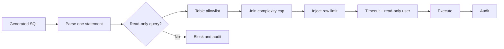

# Safe SQL

`validate_sql` rejects comments, multiple statements, DDL/DML, PRAGMA/ATTACH/COPY/CALL/EXECUTE, non-query AST roots, unknown physical tables, and excessive joins. CTE aliases are distinguished from physical tables and missing limits are added. Execution must additionally use a database-enforced read-only principal, a transaction marked read only where supported, a statement timeout, bound user values, approved columns, and cancellation. The current POC exposes and tests the validator but does not yet wire remote connection execution.

